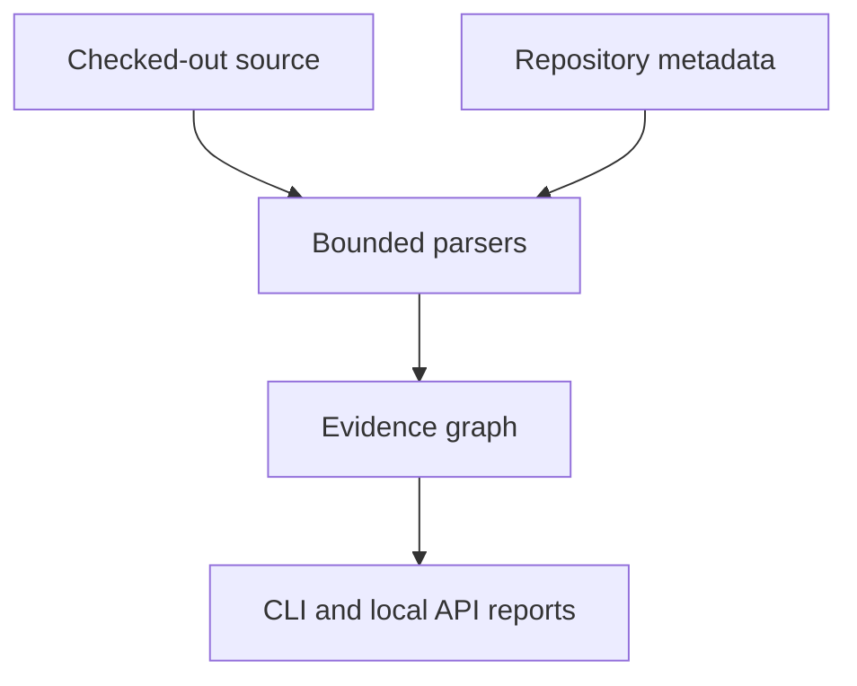

# Repository Lens

Repository Lens (`repolens`) is a read-only static analysis toolkit for one checked-out
repository. The current release focuses on JavaScript/TypeScript (including the Next.js
App Router), Python/FastAPI, and PostgreSQL references. It builds an evidence graph and
exports bounded Mermaid, Markdown, JSON, and SARIF views that a developer can review
before changing code.

The scanner parses source; it does not import or execute the target application, install
target dependencies, run migrations/builds/tests, connect to a database, clone a remote
repository, or infer runtime behavior from a name alone.

## What is implemented

| Area | Verified behavior | Important boundary |
|---|---|---|
| Python | AST functions/classes, import bindings, calls, FastAPI routes (`api_route`, `add_api_route`, websockets), dependencies, request/response models, router prefixes from constants/settings and sub-app mounts, SQLAlchemy/SQLModel/Alembic tables and foreign keys, MongoDB driver and ODM collections, literal SQL; built-in security/performance findings ranked by exposure, with route files nothing imports ranked `unreachable` and apps no deployment manifest (systemd, Dockerfile, block-style compose, Procfile, supervisord, shell or Python run script) runs ranked `undeployed` (package.json scripts and test, CI or dev files mark an app live but never make the deployment known) | Dynamic registration, factories, type dispatch and runtime authorization remain unresolved; deployment is read from manifests in the repository only and fails closed: an application named at run time (`uvicorn $APP`), a name more than one file could be, a manifest or format it cannot read (Kubernetes, Helm, App Engine, compose flow style, ...), an image whose command is not in the repository, or a reachable file importing modules chosen at run time (`pkgutil.iter_modules`) leaves it unknown |
| JavaScript/TypeScript | Tree-sitter syntax extraction; ES and CommonJS exports including aliases, `export default memo(X)` and `export * from` barrels; `tsconfig`/`jsconfig` `paths` through local `extends`; calls, `new` and JSX component renders; `fetch`, SWR, axios/ky requests with module-constant base paths and client base URLs traced across modules; Next.js App Router handlers and pages (groups, slots, catch-alls) and Pages Router pages and API routes; SQL assembled in variables, with a CLI argument or request input spliced into SQL text reported as `security/sql-string-interpolation` (numeric conversions, driver quoting helpers and placeholder lists count as safe; HTML escapers do not); a call to a path served only for other methods is `API_METHOD_MISMATCH` (a likely 405, reported as the finding `stack/api-method-mismatch`), a call with no handler at all is `API_CALL_WITHOUT_HANDLER`, and both drop to info when every caller is unreachable from any page, route or entry file, or when non-test code registers server routes the scanner does not model (named in the message); bare `&` in JSX text is not a parse error | No TypeScript compiler/type graph; package `exports` maps, a package `extends` (reported as partial), middleware, rewrites and server-action authorization are not modelled; SQL taint is traced within one file only |
| PostgreSQL | SQLGlot parsing of literal SQL (one statement at a time in `.sql` files), CTE-aware references, MERGE/TRUNCATE/GRANT/COPY, RLS/policy/trigger DDL read lexically, read/write/declare detail; SQL-shaped strings only, so UI prose is not parsed; `SQL_UNKNOWN_COLUMN` for columns missing from the Prisma schema or `CREATE TABLE` DDL (one issue per statement; single-table references only; migrations, test paths, Prisma views, ORM- or foreign-migration-managed tables and unqualified names under a changed `search_path` skipped); `SQL_DIALECT_NOT_POSTGRES` once for a `.sql` file in another dialect, which is then not read; `SQL_PLPGSQL_OUTSIDE_BLOCK` for top-level PL/pgSQL in `.sql` scripts; postgres.js/Prisma template parameters; JS/TS table declarations from Drizzle, Prisma schemas, TypeORM, Sequelize and Knex | No DSN, live catalog, RLS state, migration-head check or query-plan claim; Knex/Sequelize tables are not dialect-verified |
| Generated documentation | `docs generate`: OpenAPI 3.1 for the scanned application's routes with unresolved schemas listed as gaps, a Mermaid ER diagram from SQL DDL and Prisma, an architecture flowchart, a debugging guide, and a mindmap page and context pack per route area; `featuretrace propose`: draft FeatureTrace markers, fact-only JSDoc and stable Function Lens ids as a reviewable patch, written only with `--apply` | Business purpose, authorization and undeclared request/response shapes are not inferred; route areas are not business features; generated debugging plans are static candidates, not observed runtime paths; see [docs/documenting.md](docs/documenting.md) |
| Reports | Bounded impact traversal with evidence origin/resolution, Mermaid/Markdown/HTML/JSON, SARIF import/export; every output names the build that produced it | A “complete” scan means supported checks finished; it is not a safety or correctness proof |
| API | Authenticated loopback FastAPI service with OpenAPI/Swagger UI and a generated Postman collection | One operator-configured local checkout; no multi-tenant server or remote-provider OAuth |
| Extensions | Explicitly enabled trusted Python entry points for other file/database extractors | Plugins are not sandboxed; the local API deliberately does not load them from requests |

Frontend UI, C# analysis, GitHub/GitLab linking, OAuth, hosted workers, and live database
inspection are deliberately deferred. They are tracked in [the roadmap](docs/roadmap.md),
not represented as existing features.

## Install

The base package has no runtime dependency and keeps the existing repository-oriented
commands available. Install the focused stack and API extras for the new workflow:

```bash
python -m pip install -e '.[stack,api]'
```

For the test environment:

```bash
python -m pip install -e '.[stack,api,test]'
```

`stack` provides Tree-sitter grammars and SQLGlot. `api` provides FastAPI and Uvicorn.
Without `stack`, the lower-level `impact` command can fall back to legacy JavaScript
regex extraction and will report that limitation; `analyze` requires the stack extras so
it cannot silently present a degraded result.

### As a standalone tool

The wheel is pure Python (`py3-none-any`), so the same one installs on Linux and macOS.
An isolated install keeps repolens's extras out of the environment of the project being
analyzed and puts `repolens` on `PATH`:

```bash
python -m build                                    # writes dist/ (needs the `build` package)
pipx install 'dist/repolens-<version>-py3-none-any.whl[stack,api]'
repolens --root /path/to/checkout analyze --out .repolens/analysis
```

`uv tool install` accepts the same argument, and `bin/repolens` runs the CLI from a
checkout with nothing installed at all. Building a release, including the one line a
version bump touches, is in
[docs/installation.md](docs/installation.md#building-a-release).

## Quick start

Run against the current checkout:

```bash
repolens analyze --out .repolens/analysis
```

The command writes:

```text
.repolens/analysis/
├── analysis.json       # machine-readable graph, diagnostics and findings
├── report.md           # bounded Mermaid diagram plus review tables
├── report.html         # the same review as a self-contained page (no scripts)
├── linkage.mmd         # Mermaid-only view
└── findings.sarif      # normalized SARIF findings
```

`analysis.json` carries `complete`, `incomplete_reasons` (one line per cause of an
incomplete analysis) and `tool_build`: the repolens version, git commit and dirty flag,
a hash of the installed package sources, and the optional extras with their versions.
Each SARIF driver carries the same stamp as `properties.repolensBuild`, and `linkage.mmd`
ends with a `%% produced by` comment. `repolens report` writes `report.md`, `report.html`,
`report.json` (each with a `produced_by` build line) and `report.sarif` (with
`repolensBuild`); the report makes no completeness claim.

Inspect one concept or function without re-reading source after the snapshot:

```bash
repolens analyze --query 'save_item' --max-nodes 40 --out .repolens/analysis
```

The original impact CLI remains available:

```bash
repolens impact scan /path/to/repository
repolens impact query 'checkout' --repo /path/to/repository --format markdown
repolens impact doctor /path/to/repository
```

All scans are bounded by `max_file_bytes` and `max_files`; truncation, unreadable files,
parser recovery and unresolved relationships are explicit diagnostics rather than a
silent “clean” result.

## Local API, Swagger and Postman

The API serves one operator-selected checkout on loopback. Set a random bearer token of
at least 32 characters, then start it from the repository root:

```bash
export REPOLENS_API_TOKEN="$(python -c 'import secrets; print(secrets.token_urlsafe(32))')"
repolens serve --port 8765
```

Open Swagger UI at `http://127.0.0.1:8765/docs`; the raw contract is at
`/openapi.json` and ReDoc is at `/redoc`. The health endpoint is unauthenticated; all
analysis endpoints require `Authorization: Bearer $REPOLENS_API_TOKEN`.

Typical requests:

```bash
curl http://127.0.0.1:8765/health
curl -H "Authorization: Bearer $REPOLENS_API_TOKEN" \
     -X POST http://127.0.0.1:8765/v1/analysis \
     -H 'content-type: application/json' -d '{}'
curl -H "Authorization: Bearer $REPOLENS_API_TOKEN" \
     -X POST http://127.0.0.1:8765/v1/impact \
     -H 'content-type: application/json' \
     -d '{"query":"save_item","max_nodes":30}'
```

Generate contracts from the same FastAPI application used by `serve`:

```bash
repolens api export --out docs/api
```

Import [the Postman collection](docs/api/repository-lens.postman_collection.json) and
[local environment](docs/api/local.postman_environment.json), set `api_token`, and run
the requests in order. The checked-in [OpenAPI document](docs/api/openapi.json) is
regenerated from the application; it is not a hand-maintained second API.

## Configuration

Repository-specific settings are read from `repolens.toml` and then
`.impact-tracer.json`. The impact configuration is additive metadata and safety bounds;
it is not imported as application code. A minimal example:

```toml
[impact]
backend_api_prefix = "/api"   # for a prefix the code does not declare (proxy, root_path); not added to routes that already resolve to it
max_file_bytes = 2000000
max_files = 10000
pg_schemas = ["public", "inventory"]
client_api_base = "/api"      # base path for an HTTP client the scanner cannot trace to its declaration
client_receivers = ["http"]   # receiver names that are such clients
api_origins = ["PAYMENTS_API_URL"]  # origin names that are this API although their words say otherwise
respect_gitignore = true      # graph and Python checks skip untracked files git ignores; tracked files are always read
roles = ["admin", "operator"]

[scan]
# Files the server runs, beyond the apps and deployment manifests found automatically.
entrypoints = []
# Rank route files that no systemd unit, Dockerfile, compose file, Procfile, supervisord
# program or shell script runs as "undeployed" (never hidden). package.json scripts and
# test/CI/dev files mark an app live but never make the deployment known, and anything
# the reader cannot follow (an unnamed app, an unread format) leaves nothing demoted.
deployment_detection = true

[scan.migrations]
roots = ["backend/alembic/versions"]
```

The scanner accepts relative artifact paths only. Absolute paths, `..` traversal and
drive-qualified paths are rejected. The API takes only bounded scan values from a
request and always layers them over the repository’s policy; it never accepts a source
path, command, repository URL or plugin name from the caller.

## Evidence and diagrams

Every graph edge keeps its origin (`tree-sitter`, `python_ast`, `sqlglot`, declared
metadata, heuristic, and so on) separate from its resolution (`exact`, `high`,
`probable`, `declared`, or `ambiguous`). “Exact” describes the syntax or declaration
that was observed; it does not mean the code will execute at runtime. Mermaid output is
bounded and escapes repository-controlled labels so report text cannot inject Mermaid
directives.



## Extending languages and databases

Additional trusted extractors can be installed as Python entry points in the
`repolens.extractors` group. A plugin declares `api_version = 1`, a unique `name`, a
version, lowercase suffixes, and `analyze(SourceFile) -> Extraction`. Enable one
explicitly with:

```bash
repolens analyze --plugin my-extractor
```

Use `repolens analyze --list-plugins` to inspect installed entry-point metadata without
loading plugin code. See [docs/plugins.md](docs/plugins.md) for the contract and safety
rules. A future C# or database adapter should live in a plugin rather than adding an
unverified language guess to the core scanner.

## Testing

```bash
python -m unittest discover -s tests -q
```

The suite covers bounded reads and cache fingerprints, JavaScript/TypeScript syntax and
Next.js routes, FastAPI mounts, PostgreSQL SQL/ORM references, Mermaid sanitization,
SARIF validation, API auth/concurrency/contracts, and report output. `pytest` is not a
runtime requirement for the project’s own tests.

## Documentation

- [docs/documenting.md](docs/documenting.md) — documenting and debugging an undocumented application: generated OpenAPI, schema and maps, proposed markers, JSDoc and Function Lens ids
- [docs/impact.md](docs/impact.md) — lower-level graph and query reference
- [docs/lessons/README.md](docs/lessons/README.md) — technical lessons learnt: 260 stack-level traps with detection recipes, as JSON, a browsable page and Markdown rule packs
- [docs/api/README.md](docs/api/README.md) — Swagger/OpenAPI/Postman workflow
- [docs/plugins.md](docs/plugins.md) — extractor extension contract
- [docs/roadmap.md](docs/roadmap.md) — implemented scope, open gaps and priorities
- [docs/installation.md](docs/installation.md) — install, building a release, CI, upgrading and vendoring a copy
- [CHANGELOG.md](CHANGELOG.md) — changes and upgrade notes by release
- [docs/history/](docs/history/) — the 0.2 roadmap and installation guide, verbatim, for older references
- [docs/audit/2026-09-12-professional-foundation.md](docs/audit/2026-09-12-professional-foundation.md) — deep-dive verification and confidence ratings

MIT licensed; see [LICENSE](LICENSE).
